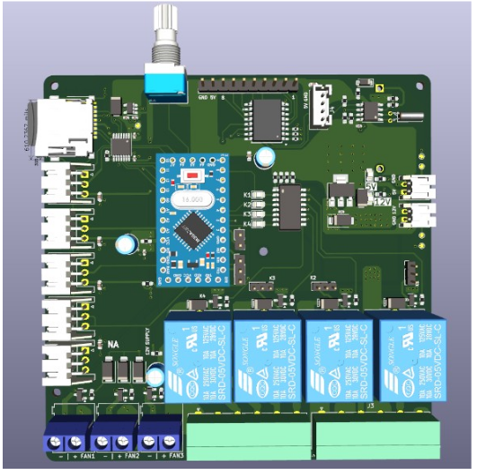
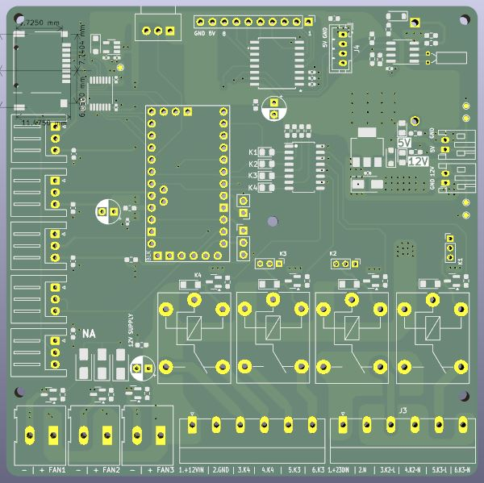

# 🌿 Climate controller greenhouse based on Atmega pro mini a

## 📌 Description
Climate controller is a project for automating climate inside greenhouse. There's main features: measure and control enviroment inside (temperature and humidity), soil humidity and can control outputs for irrigation system with internal clock. Data is stored on SD card and are show on LCD screen.
Based on indoor growing controller I evolve project for greenhouse option which will be supply from batteries system with solar panels.

## 🧠 Features
- Temperature and humidity measurement (currently tested sensors SHT40)
- Soil moisure measurement (cheap capacitive soil sensors)
- Fan controlling with PWM pulse
- Irrigation controlling with relays and transistors,
- LCD screen for basic info
- 4 relays outputs for example additional light, irrigation sectors,
- RTC with internal clock (I2C)

## 🛠️ Tech
- **Microcontroller**: Arduino, currently migration to ESP32 S3
- **Sensors**: DHT22/ SHT40, capacitive soil sensors
- **Interfaces**: UART, I2C
- **Screen**: LCD 16x2 z konwerterem I2C
- **PCB project**: KiCad
- **Programowanie**: C/C++ (Arduino IDE)/ VS Code

